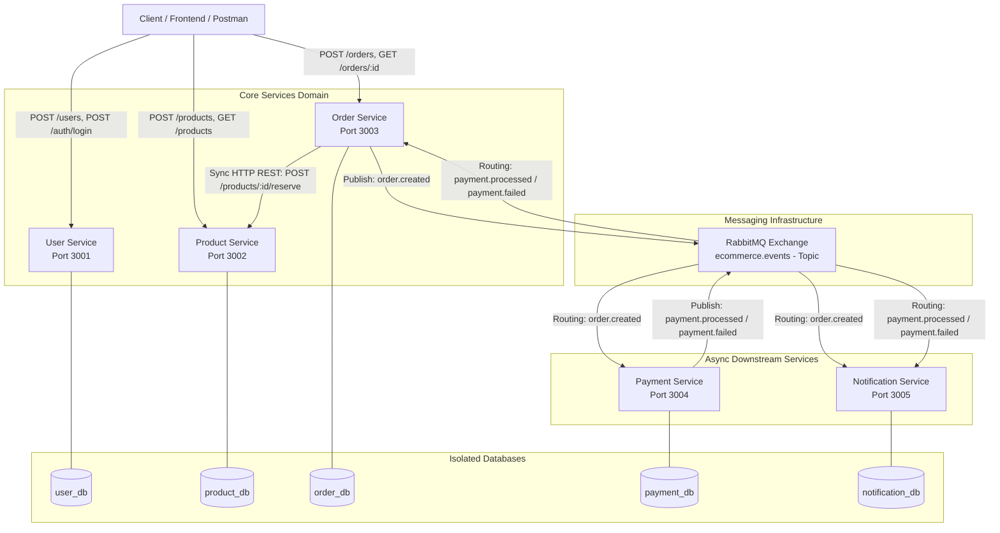
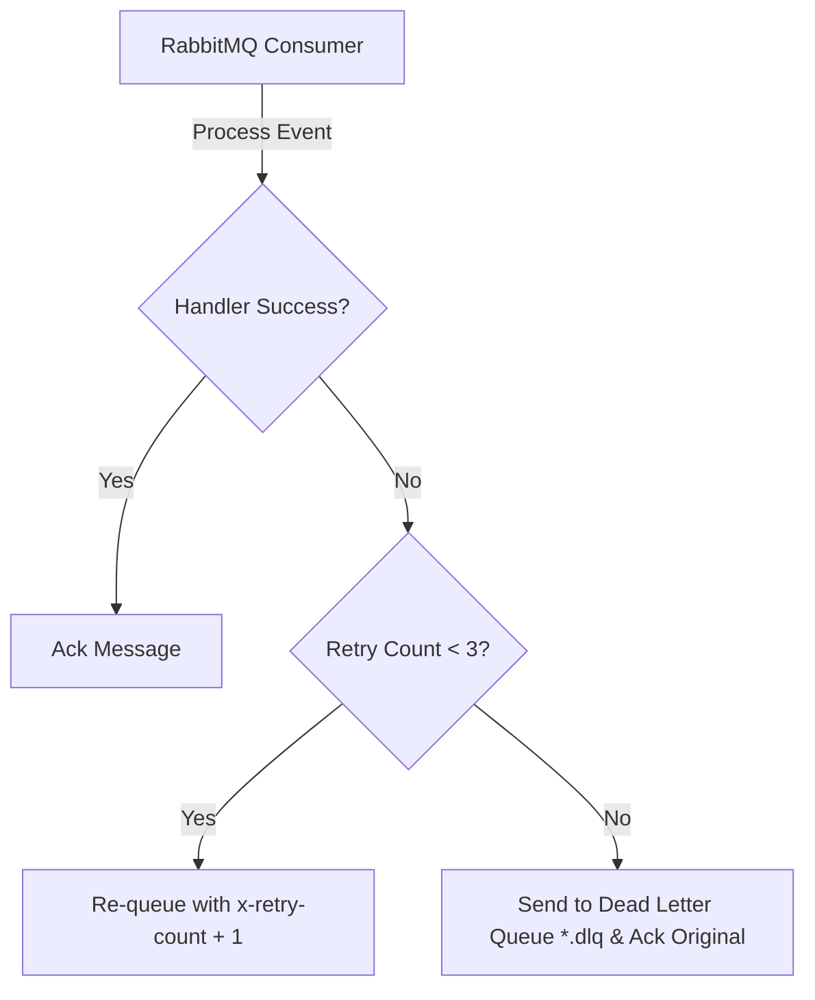

# Microservices Architecture & Event-Driven Design Specification

## 1. Executive Summary

This document details the architectural design for the **E-Commerce Microservices Platform** following its evolution into a hybrid synchronous/asynchronous event-driven architecture in **Week 2**.

The system balances instant transactional requirements (synchronous REST) with resilient, non-blocking asynchronous event processing powered by **RabbitMQ**.

---

## 2. Overall System Architecture Diagram



---

## 3. Communication Patterns: Sync REST vs Async AMQP

### 3.1 Synchronous REST (HTTP/JSON)
- **Used For**:
  - User Authentication & Authorization (`User Service`)
  - Product catalog reads and inventory reservation (`Product Service`)
  - Order creation submission (`Order Service`)
- **Rationale**: Direct client responsiveness requires real-time feedback and immediate validation before initiating order creation.

### 3.2 Asynchronous Event Messaging (RabbitMQ / AMQP)
- **Used For**:
  - Order checkout completion (`OrderCreated`)
  - Asynchronous Payment execution & status callback (`PaymentProcessed`, `PaymentFailed`)
  - Multi-channel User notifications (`Notification Service`)
- **Rationale**: Downstream tasks do not block client response latency. If Payment Service or Notification Service experience temporary load spikes or downtime, messages persist safely in RabbitMQ without dropping user requests.

---

## 4. RabbitMQ Exchange & Queue Topology

### Exchange
- **Name**: `ecommerce.events`
- **Type**: `topic`
- **Durable**: `true`

### Queues, Binding Keys, and DLQs

| Queue Name | Routing Key Bindings | Primary Consumer | Dead Letter Queue (DLQ) |
| :--- | :--- | :--- | :--- |
| `order.queue` | `payment.processed`, `payment.failed` | Order Service | `order.dlq` |
| `payment.queue` | `order.created` | Payment Service | `payment.dlq` |
| `notification.queue` | `order.created`, `payment.processed`, `payment.failed`, `notification.requested` | Notification Service | `notification.dlq` |

---

## 5. Event Envelope Specification

All events published across `ecommerce.events` follow a standardized, strictly typed JSON envelope format:

```json
{
  "eventId": "c8d234eb-5d90-482a-9fbc-91b3e8c2810a",
  "eventType": "OrderCreated",
  "timestamp": "2026-09-25T16:00:00.000Z",
  "source": "order-service",
  "data": {
    "orderId": "order-uuid-1234",
    "userId": "user-uuid-1234",
    "totalAmountInPaise": 1500000,
    "items": [
      {
        "productId": "prod-uuid-1234",
        "quantity": 1,
        "priceInPaise": 1500000
      }
    ]
  }
}
```

---

## 6. Financial Data Representation (Money in Paise)

- To prevent floating-point precision issues inherent in IEEE 754 numbers (e.g. `0.1 + 0.2 !== 0.3`), all monetary amounts across schemas, REST contracts, and RabbitMQ events are formatted as **positive integers representing currency in paise**.
- Example: `₹1,500.50` -> `150050`.

---

## 7. Inventory Reservation & Race Condition Safeguards

- Stock availability checks and decrements are performed atomically inside Product Service database transactions:
  ```js
  await prisma.$transaction(async (tx) => {
    const product = await tx.product.findUnique({ where: { id } });
    if (!product || product.stock < quantity) {
      throw new InsufficientStockError();
    }
    return tx.product.update({
      where: { id },
      data: { stock: { decrement: quantity } }
    });
  });
  ```
- Attempts to reserve more inventory than currently available return `409 Conflict` (`INSUFFICIENT_STOCK`).

---

## 8. Failure Modes, Retries & Dead Letter Handling



1. **Retry Strategy**: Failed message processing is re-sent up to **3 times** with an incremented `x-retry-count` header.
2. **Dead Letter Queue (DLQ)**: Once `x-retry-count >= 3`, the message is routed to its service DLQ (`*.dlq`) with full failure context (`failureReason`, `originalRoutingKey`, `timestamp`).
3. **Idempotency**: Consumers check `eventId` and `orderId` in local databases before processing. Duplicate messages are safely acknowledged and skipped.
