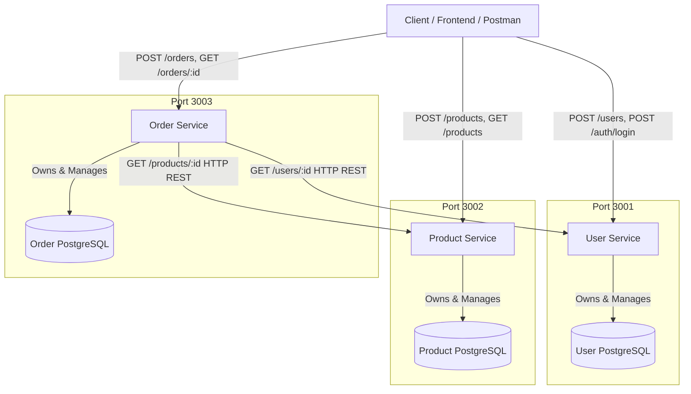

# Architecture Documentation

## Overview

The E-Commerce Microservices Platform is designed following modern cloud-native microservice principles. In **Week 1**, the core application foundation is implemented using standard REST APIs and isolated databases for each service.

---

## Core Architectural Principles

### 1. Database-per-Service Pattern
Each microservice is completely autonomous and owns its dedicated PostgreSQL database (`user_db`, `product_db`, `order_db`).
- **Data Isolation**: Services cannot directly read or mutate tables belonging to another service.
- **Independent Scaling & Schemas**: Schema modifications or database engine choices in one service do not break or block other services.
- **No Cross-Database Foreign Keys**: Order Service maintains `userId` and `productId` references as application-level attributes rather than SQL foreign key constraints across database boundaries.

### 2. Service-to-Service Communication
Order Service communicates synchronously with User Service and Product Service via HTTP REST APIs:
- **User Validation**: Order Service calls `GET /users/:id` on User Service to verify user existence.
- **Product & Inventory Validation**: Order Service calls `GET /products/:id` on Product Service to verify product existence, check stock availability, and retrieve the **authoritative server-side price**.
- **Security & Integrity**: Prices provided by clients in HTTP request bodies are strictly ignored. Order totals are always calculated on the backend using prices retrieved directly from Product Service.

---

## Architectural Evolution Roadmap

### Week 1 (Current)
Synchronous HTTP REST communications between Order Service, User Service, and Product Service.

### Week 2 (Next Phase - Async Messaging)
Integration of **RabbitMQ** message broker for asynchronous event-driven workflows:
- `order.created` event published by Order Service upon checkout.
- **Payment Service** listens for `order.created` events and processes payments asynchronously.
- **Notification Service** sends order confirmation emails/SMS upon payment completion.

### Week 3 & 4 (Containerization & Orchestration)
- **Docker**: Containerizing each microservice with optimized Dockerfiles.
- **Kubernetes (K8s)**: Deploying services into local Kubernetes clusters (Minikube / Kind) using Deployments, Services, ConfigMaps, Secrets, and Liveness/Readiness probes.

### Week 5 - 8 (Production Infrastructure & Observability)
- **Terraform & AWS/EKS**: Provisioning managed infrastructure (EKS cluster, RDS PostgreSQL, VPC).
- **CI/CD**: Automated GitHub Actions pipelines for build, test, and container deployment.
- **Observability**: Prometheus & Grafana for metrics monitoring; ELK Stack for centralized log aggregation.
